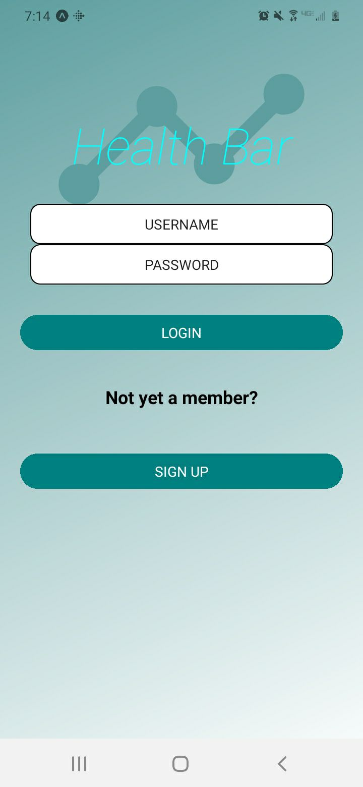
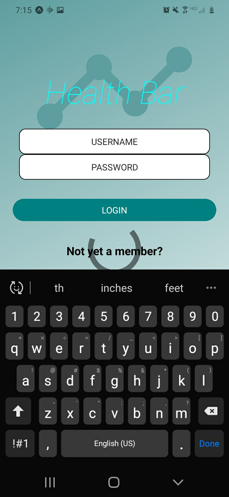
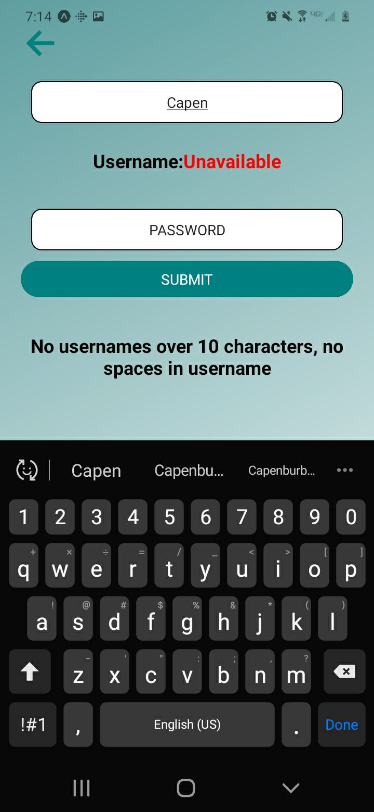
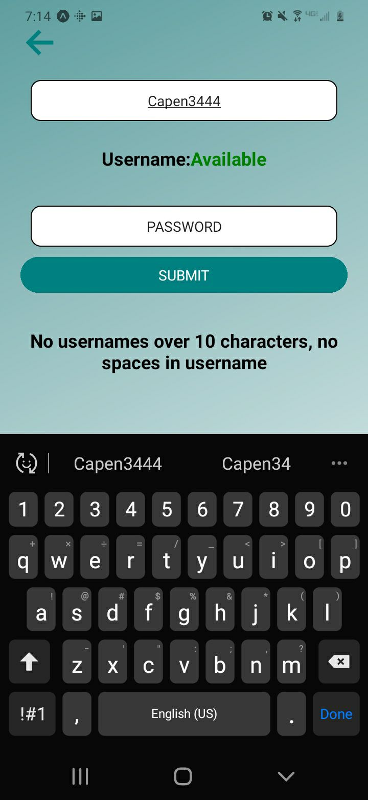
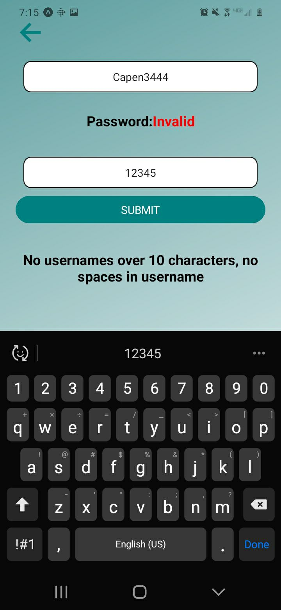
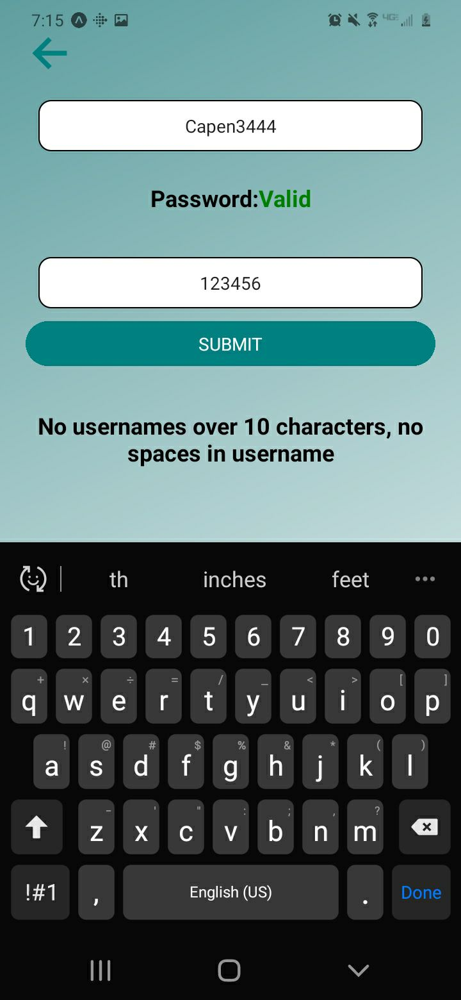
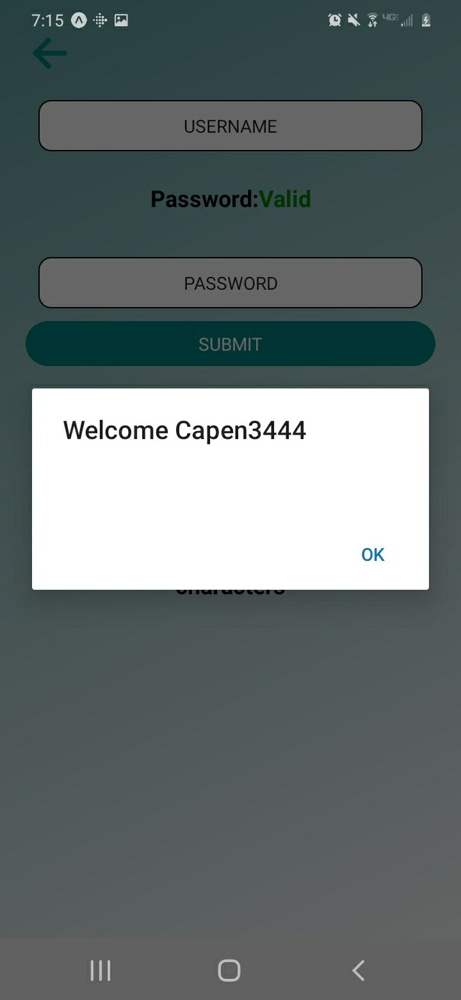
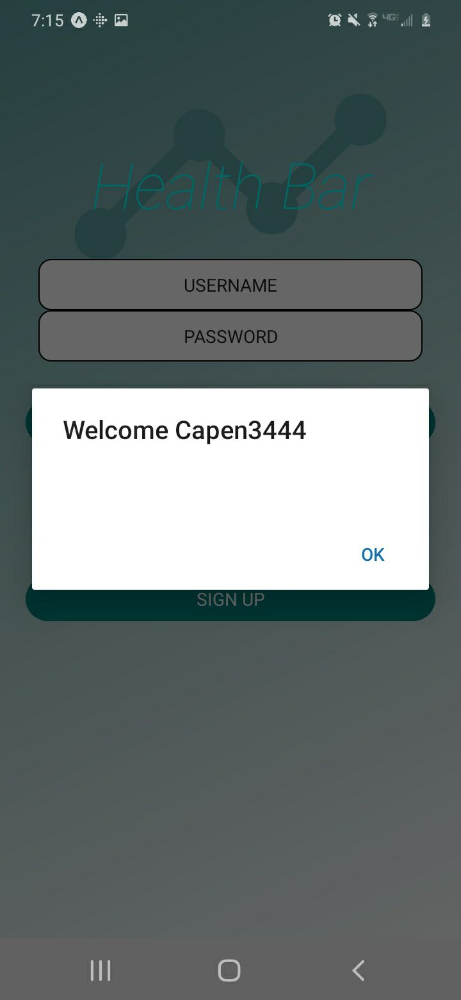

# chronic_illness_phone_application 

For android only as of 6/14/2021, goal to have application running fluidly on ios soon

The purpose of this project is to create an application that will help people log and track a symptom or symptoms they are experiencing
in order to keep a better record of their health without any hassle.

As of 6/14/2021 the project is written entirely usign Javascript/ React/ and React-Native

The Database of choice is a noSQL using google's Cloud Firestore

npm dependencies include:  
"@expo/ngrok": 2.4.3,                                                           
"@expo/vector-icons": 12.0.0,  
"@ptomasroos/react-native-multi-slider": 2.2.2,   
"@react-native-community/slider": 3.0.3,   
"@react-native-firebase/app": 11.3.3,  
"@react-navigation/bottom-tabs": 5.11.10,  
"@react-navigation/native": 5.9.4,  
"@react-navigation/stack": 5.14.5,  
"expo": 41.0.1,  
"expo-asset": 8.3.2,  
"expo-file-system": 11.0.2,  
"expo-linear-gradient": 9.1.0,  
"expo-sqlite": 9.1.0,  
"expo-status-bar": 1.0.4,  
"firebase": 8.4.2,  
"firebase-admin": 9.6.0,  
"react": 16.13.1,  
"react-dom": 16.13.1,  
"react-native": https://github.com/expo/react-native/archive/sdk-41.0.0.tar.gz,  
"react-native-chart-kit": 6.11.0,  
"react-native-gesture-handler": 1.10.3,  
"react-native-scrollable-tab-view": 1.0.0,  
"react-native-web": 0.13.12,  
"react-navigation": 4.4.4,  
"react-navigation-stack": 2.10.4,  
"react-redux": 7.2.4,  
"redux": 4.1.0  
    
To run the application yourself you will need expo-cli installed on your computer as well as downloading the expo-go mobile app for your android device  
https://docs.expo.io/get-started/create-a-new-app/  

Login Screen Upon initial loading  
 

 
 
  
Login Authentication  
  

 
 
  
Sign up Screen  
Using asynchronous noSQL queries and updating immediately to UI to verify if a username is available  
    
  
 
 

Sign up Screen    
Using asynchronous noSQL queries and updating immediately to UI to verify if a username is available    
  

 
 

Sign up Screen    
Validation on password formatting seen here and in the following picture going from password length of 5, to length of 6  
  

 
 
 
  

 
 

Once username and password have been verified,  
noSQL query executed  
you are given user feedback to confirm your account was created  
and immediately re-directed back to the login screen to login  
as observed in the 2 following pictures  

 
 

