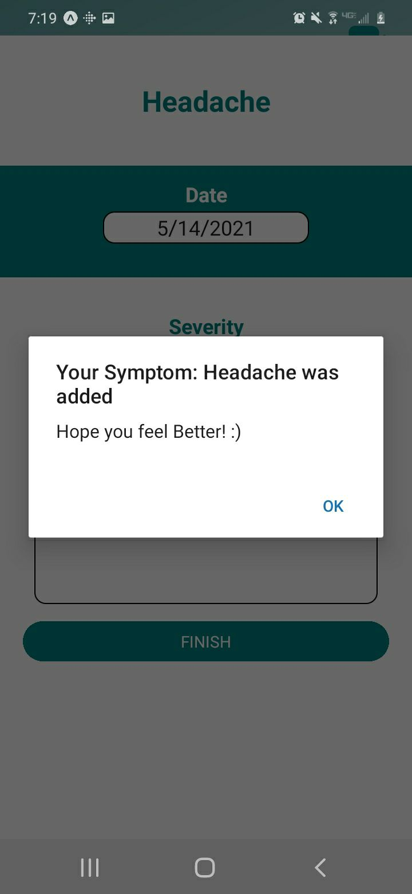
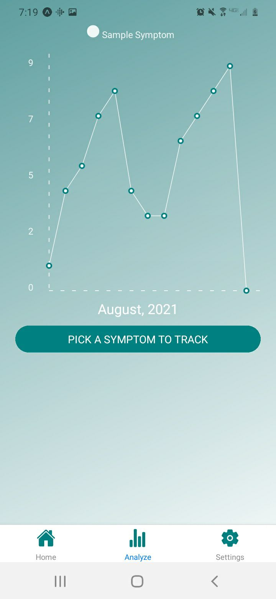

# chronic_illness_phone_application 

For android only as of 6/14/2021, goal to have application running fluidly on ios soon

The purpose of this project is to create an application that will help people log and track a symptom or symptoms they are experiencing
in order to keep a better record of their health without any hassle.

As of 6/14/2021 the project is written entirely usign Javascript/ React/ and React-Native

The Database of choice is a noSQL using google's Cloud Firestore

npm dependencies include:  
"@expo/ngrok": 2.4.3,                                                           
"@expo/vector-icons": 12.0.0,  
"@ptomasroos/react-native-multi-slider": 2.2.2,   
"@react-native-community/slider": 3.0.3,   
"@react-native-firebase/app": 11.3.3,  
"@react-navigation/bottom-tabs": 5.11.10,  
"@react-navigation/native": 5.9.4,  
"@react-navigation/stack": 5.14.5,  
"expo": 41.0.1,  
"expo-asset": 8.3.2,  
"expo-file-system": 11.0.2,  
"expo-linear-gradient": 9.1.0,  
"expo-sqlite": 9.1.0,  
"expo-status-bar": 1.0.4,  
"firebase": 8.4.2,  
"firebase-admin": 9.6.0,  
"react": 16.13.1,  
"react-dom": 16.13.1,  
"react-native": https://github.com/expo/react-native/archive/sdk-41.0.0.tar.gz,  
"react-native-chart-kit": 6.11.0,  
"react-native-gesture-handler": 1.10.3,  
"react-native-scrollable-tab-view": 1.0.0,  
"react-native-web": 0.13.12,  
"react-navigation": 4.4.4,  
"react-navigation-stack": 2.10.4,  
"react-redux": 7.2.4,  
"redux": 4.1.0  
    
To run the application yourself you will need expo-cli installed on your computer as well as downloading the expo-go mobile app for your android device  
https://docs.expo.io/get-started/create-a-new-app/  

Login Screen Upon initial loading  
 

 
 
  
Login Authentication  
  

 
 
  
Sign up Screen  
Using asynchronous noSQL queries and updating immediately to UI to verify if a username is available  
    
  
 
 

Sign up Screen    
Using asynchronous noSQL queries and updating immediately to UI to verify if a username is available    
  

 
 

Sign up Screen    
Validation on password formatting seen here and in the following picture going from password length of 5, to length of 6  
  

 
 
 
  

 
 

Once username and password have been verified,  
noSQL query executed  
you are given user feedback to confirm your account was created  
and immediately re-directed back to the login screen to login  
as observed in the 2 following pictures  

 
 

 
 
 

After authentication is complete  
you will load into the home page of the profile  
here we can see custome pressable icons allowing us:  
-log any symptoms we are experiencing  
-analyze our symptom data  
-go to our journal(not yet implemented)  
-go to the community(not yet implemented) 
  

 
 

Settings Screen accessed through bottom tab navigation once logged in     
*Functionality of settings screen has not yet been implemented, only visually implemented for now*

 

 
 

Modal for logging your symptoms.  
Over the next few pictures,  
you will see different tabs render different lists of symptoms:  
-custom: symptoms you've logged before  
-common: example symptoms that you could log  
-frequent: most recently logged symptoms from custom list(not yet implemented)  
-new: text input to add a brand new symptom if needed  

 
 

 
 

When using our search bar located at the top of the modal,  
you will notice that lists begin to re-render data as soon as there is value in the text input field  

 
 

 
 

After choosing a symptom  
You will be prompted with another modal  
where your chosen symptom will appear at the top  
the date will autofill to the current date in format mm/dd/yyyy  
you will have a sliding scale to indicate on a severity of 1 through 10 how bad your symptom was  
and a section for additional notes you'd like to add to that day to use when analyzing your data  
 

 
 

 
 
 

And after submitting that payload of data, you will be greeted with a confirmation message that also lets you know  
that it hopes you feel better :)
 

 
 

Initial look at data analysis page, you can reach this page  
by hitting the touchale icon Analyze on the Home screen  
or by clicking touching the Analyze tab choice located at the bottom of the screen once loaded into the app.
You will notice that our graph right now is only displaying a sample of useless data for show
 

 
 

However when we press "Pick A symptom to Track"  
We have another modal, built similarly to our previous list modal  
however this one will only render symptoms that you have logged, as you can't analyze data if it doesn't exist  
We have also implemented the same search/render feature as shown in our previous modal lists.
 

 
 

Upon choosing a symptom to track, (please keep in mind that this is currently only in month view for the chart)  
You will have a confirmation message, and your data, for that specific month, tracking that specific symptom  
will chronologically organize your data  
update the chart to match your new dataset  
and if you have logged a symptom more than once a day  
the graph will display an average  
but after touching that data point  
you will be given a lists of times you logged that symptom on that day  
with their own unique data including:  
-severity  
-notes  
-exact time(to be implemented later)  

 

 
 

